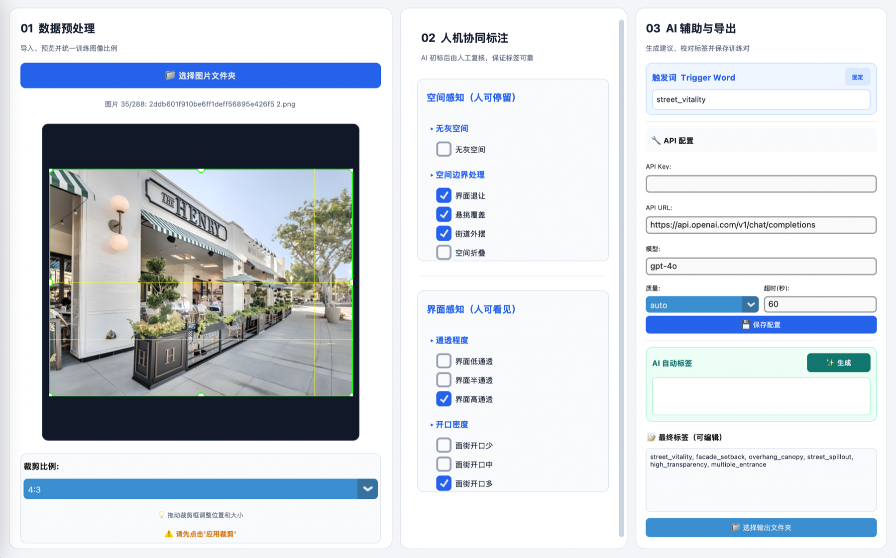

# Street Vitality AIGC

用领域标签体系、AI 辅助标注和 SDXL LoRA 微调，探索如何让图像生成模型学习“支撑街道活力发生的空间条件”，而不是依赖人群、灯光、广告牌或高饱和度画面制造表面热闹。

> 本仓库是面向作品集与技术交流整理的公开版本，重点展示从问题定义、标签体系、AI 辅助标注工具、LoRA 训练配置到评测设计的完整实践。项目最初源于课程团队研究；公开仓库不主张对团队共同研究或第三方素材的排他性所有权。


## 项目背景

街道既承担通行，也承载停留、交流与日常生活。基础图像模型虽然能够生成完成度较高的街景效果图，却容易把“活力”简化为人多、商业元素多或色彩明亮，难以回答更本质的问题：当人物和显性活动被移除后，空间本身是否仍能传递“可以进入、停留和使用”的信号？

本项目以可供性（Affordance）为线索，将抽象的街道活力感转译为可观察、可标注和可生成的空间变量，并验证这些变量如何影响专业与非专业人群的活力判断。

## 研究问题

1. 如何把“街道活力”从模糊感知转化为可供模型学习的设计语言？
2. SDXL 经过领域 LoRA 微调后，能否更稳定地响应空间设计手法、界面通透度和沿街开口密度？
3. 在排除人群与显性活动后，哪些空间条件仍能提升公众对街道活力的感知？

## 技术路线

```text
GPT-4o 辅助梳理研究问题、技术方案与评测框架
  -> 活力概念拆解
  -> 标签体系与数据清洗标准
  -> AI 图像增强（颜色 / 清晰度 / 去除人物）+ 人工质检
  -> GPT-4o 视觉初标 + 人工复核
  -> 288 张候选图像与 Caption 配对质检
  -> SDXL 1.0 / LoRA 微调 UNet（16 Epoch）
  -> 5 x 3 x 3 全因子提示词生成
  -> Base / LoRA 对照评测
  -> 问卷、统计分析与访谈编码
  -> Bad Case 归因与数据/训练迭代
```


## 项目过程展示

### 1. 数据集构造与 AI 图像增强

为了让模型学习空间条件，而不是记住人物数量、摄影质量或夸张色彩，入库前先执行统一的图像质检与增强流程：

1. **质量审计**：检查分辨率、宽高比、视角、遮挡和重复图像；短边低于 768 px 的图片进入低质量复核队列。
2. **颜色校正**：调整曝光、白平衡、对比度和饱和度，使不同来源图片尽量保持自然、统一的视觉基线，避免将高饱和误当成高活力。
3. **清晰度增强**：对轻微模糊或压缩明显的图像进行降噪、锐化与适度超分辨率处理；无法恢复真实细节的图片直接剔除。
4. **人物去除**：使用生成式修复移除主要人物及明显活动主体，再由人工检查补绘区域的透视、材质和空间连续性。
5. **标签保护**：增强过程不得新增、删改沿街入口、通透界面、灰空间或外摆等关键空间证据；一旦影响标签判断，回退原图或放弃样本。
6. **人工终审**：对颜色真实性、空间结构、修复痕迹和标签可判定性进行复核，合格后才进入标注与训练环节。

这一步的产品目标不是“把图片变得更好看”，而是减少人物、画质和色彩带来的混杂因素，让数据集更接近研究问题本身。

### 2. 训练数据与 Caption

训练图像先由 GPT-4o 的视觉能力根据封闭标签体系完成初标，再由人工复核。每张 PNG 对应一个同名 TXT Caption，供 SDXL LoRA 训练读取。

| 训练样例 1 | 训练样例 2 | 训练样例 3 |
|---|---|---|
|  |  |  |
| `facade_setback, overhang_canopy, high_transparency, limited_entrance` | `overhang_canopy, street_spillout, medium_transparency, multiple_entrance` | `facade_setback, overhang_canopy, street_spillout, high_transparency, multiple_entrance` |

| 训练样例 4 | 训练样例 5 |
|---|---|
|  |  |
| `facade_setback, high_transparency, multiple_entrance` | `overhang_canopy, spatial_folding, medium_transparency, limited_entrance` |

### 3. 低活力图像增强

选取前序评价中活力感得分较低的图像，通过图生图统一加入“街道外摆、中等通透度、中等沿街开口”条件，观察可停留线索对活力感知的影响。

| 组别 | 修改前 | 修改后 |
|---|---|---|
| 低活力样本 1 |  |  |
| 低活力样本 2 |  |  |
| 低活力样本 3 |  |  |

6 组完整对照、修改前标签与评分见 [`evaluation/vitality-enhancement.md`](evaluation/vitality-enhancement.md)。

### 4. Checkpoint 对比与模型选择

早期实验对 10/20/30 Epoch checkpoint 使用相同提示词进行横向比较，重点检查标签响应、空间真实性、材质质量、构图重复和过拟合趋势。下图提示词为 `spatial_folding, street_spillout, low_transparency, limited_entrance`。

| 10 Epoch | 20 Epoch | 30 Epoch |
|---|---|---|
|  |  |  |

该组结果属于探索性 checkpoint 测试，最终复现实验采用 16 Epoch。更多说明见 [`evaluation/checkpoint-testing.md`](evaluation/checkpoint-testing.md)。

### 5. LoRA 标签控制效果

模型能够分别响应空间设计手法、界面通透度和沿街开口数量，也能在组合提示词下同时控制多个空间变量。下图汇总了单标签与组合标签的代表性生成结果。


## 标签体系

标签分为两个感知维度，共 11 个封闭标签：

- 空间感知（人可停留）：无灰空间、界面退让、悬挑覆盖、街道外摆、空间折叠。
- 界面感知（人可看见）：低/中/高通透，以及沿街开口少/中/多。

每个标签均定义了可见证据、排除条件、互斥关系和证据不足时的处理方式。通透度依据透明界面比例、室内可见程度和遮挡情况判断；开口密度独立依据可确认的步行入口数量判断，避免混淆两个概念。

详细定义见 [`半自动图像标注工具/prompt_config.json`](半自动图像标注工具/prompt_config.json)。

## AI 辅助标注工具

为解决重复标注效率低、模型输出不稳定的问题，我借助 AI Coding 开发了 Python 桌面端半自动标注工具，将数据预处理、人机协同标注和训练对导出整合在一个工作流中。



- 批量导入、预览及规定比例裁剪；
- 对短边低于 768 px 的图片进行质量提示；
- 调用 GPT-4o 视觉能力，依据封闭标签体系生成初标；
- 人工检查、修改并确认，避免将模型判断直接视为真值；
- 自动合并触发词、人工标签与 AI 标签，输出同名 PNG 与 TXT Caption；
- 通过标签白名单、去重、顺序校验和互斥规则拦截异常输出；
- 自动生成文本统计报告，记录处理数量、标签分布和分类占比。

工具默认配置为 GPT-4o；模型名称与 API 地址保持可配置，以便在成本、能力和可用性之间切换兼容视觉模型。

工具说明见 [`半自动图像标注工具/README.md`](半自动图像标注工具/README.md)。

## 我如何与 AI 合作完成这个项目

我没有把 AI 当作替代专业判断的一键生成器，而是把它放在适合机器发挥的环节：快速整理信息、生成初稿、处理重复任务和辅助发现问题；研究定义、数据标准、结果判断与最终取舍仍由我负责。

| 阶段 | AI 承担的工作 | 我的判断与控制 |
|---|---|---|
| 方案设计 | 借助 GPT-4o 梳理研究背景、训练链路和评测框架，将多轮讨论沉淀为项目与技术方案 | 定义真正要解决的问题，补充边界条件，避免把“街道活力”简化为人多或画面鲜艳 |
| 数据构造 | 辅助颜色校正、清晰度增强、人物移除和低质量图片筛查 | 保护入口、通透界面和灰空间等关键证据；人工检查修复痕迹与空间真实性 |
| 半自动标注 | GPT-4o 根据规则生成初标；AI Coding 辅助开发桌面工具与校验逻辑 | 制定标签体系、可见证据、互斥关系与数量阈值，并逐张复核 |
| 模型训练 | 辅助整理 SDXL LoRA 参数、训练记录和 checkpoint 对比维度 | 决定仅训练 UNet、16 Epoch 等策略，并识别过拟合与数据偏差 |
| 评测迭代 | 辅助汇总 Bad Case、结构化评分和提出可能原因 | 从提示词遵循度、空间真实性、色彩真实性和设计可用性判断原因，调整数据、标签与微调策略 |

### 关键挑战与解决方案

1. **抽象标签难以被 AI 稳定理解。** 例如“沿街开口多”不能只写成概念定义。我将它改写为可见证据：先统计可确认的步行入口，0–1 个为开口少，2–3 个为开口中，4 个及以上为开口多，再执行分类。
2. **AI 会产生中文标签或未定义标签。** Prompt 中限定固定输出格式和标签互斥关系，程序端增加英文标签白名单、去重和顺序校验，形成“模型约束 + 程序兜底 + 人工复核”三层防线。
3. **效果与调用成本需要权衡。** 初期用 GPT-4o mini 做小样本测试，但其对界面退让、空间折叠等专业语义判断不稳定，因此切换至 GPT-4o，并通过规则前置、只返回标签和限制输出长度控制成本。
4. **增强图片可能污染研究变量。** 去除人物和提升清晰度时，生成式修复可能改变入口或界面结构，因此设置标签保护规则；任何影响关键空间证据的样本都回退或剔除。

最终形成了“方案制定 → 数据集构造与增强 → 人机混合标注 → LoRA 训练 → 对照评测 → 问题归因与迭代”的闭环。在项目阶段性记录中，LoRA 相较 SDXL Base 的四项综合评分提升 36%，同时显著减少了重复性标注工作。

## 模型训练

- 基座模型：Stable Diffusion XL 1.0
- 数据规模：288 张候选街道图像；当前目录审计得到 285 组严格同名图文对
- 训练方式：LoRA，仅训练 UNet
- 分辨率：1024 x 1024，启用多尺度 Bucket
- LoRA：Rank 128，Alpha 64
- 优化器：AdamW8bit
- 调度器：Cosine，Warmup 500 steps
- 训练周期：16 Epoch
- 混合精度：BF16

脱敏后的完整训练配置见 [`configs/sdxl-lora.toml`](configs/sdxl-lora.toml)。数据因来源和授权限制未直接公开，详见 [`docs/data-card.md`](docs/data-card.md)。

## 评测设计

采用 5 种空间设计手法 x 3 档界面通透度 x 3 档沿街开口密度的全因子设计，共 45 个测试情境。在固定随机种子、图像尺寸和推理参数的条件下，生成 SDXL Base 与 LoRA 配对样本。

人工盲评采用四项 5 分制指标：

1. 提示词遵循度；
2. 空间真实性；
3. 色彩与材质合理性；
4. 设计可用性。

此外，通过问卷与访谈比较专业和非专业被试的活力感知路径。评测矩阵和评分口径见 [`evaluation/`](evaluation/)。

项目还包含两组补充实验：一组用 6 张低活力样本验证“街道外摆 + 中通透 + 中开口”的图生图增强效果；另一组记录早期 10/20/30 Epoch checkpoint 的提示词响应与过拟合观察。详见 [`evaluation/vitality-enhancement.md`](evaluation/vitality-enhancement.md) 与 [`evaluation/checkpoint-testing.md`](evaluation/checkpoint-testing.md)。

## 主要发现

- 能够支持活动的灰空间、适度的界面通透度和开口数量，更容易提升街道活力感。
- 街道外摆的促进作用最明显，其价值不只是装饰，而是向使用者释放“允许停留”的行为信号。
- 通透度与开口数量并非越高越好；过高可能带来过度暴露、隐私缺失和界面单调。
- 专业被试更依赖结构化设计图式，非专业被试更依赖场景和社会联想。
- 在 45 组配对样本的四项综合评分中，LoRA 模型相较 SDXL Base 的项目记录提升为 36%。原始逐样本评分仍需在公开前补充，以支持结果复核。

## 仓库结构

```text
street-vitality-aigc/
├── README.md
├── configs/              # 脱敏训练配置
├── docs/                 # 研究报告、数据卡与模型卡
├── evaluation/           # 45 组实验矩阵与评分口径
├── examples/             # 训练样例、活力增强对照与 checkpoint 样例
└── 半自动图像标注工具/   # GPT-4V 半自动图像标注工具
```

## 快速开始

```bash
cd 半自动图像标注工具
python3 -m venv .venv
source .venv/bin/activate       # Windows: .venv\Scripts\activate
python -m pip install -r requirements.txt
python labeling_tool.py
```

首次使用 AI 初标前，在工具内配置 API Key、兼容的 Chat Completions 地址与视觉模型名称。请勿提交自动生成的 `api_config.json`。

## 局限与后续工作

- 训练数据规模较小，仍可能存在视角、风格和地域偏差；
- 原始目录有 3 张图像未形成严格同名 Caption 配对，训练前应按数据审计记录修复；
- 视觉模型初标不构成真值，所有训练标签均需人工复核；
- 36% 为项目阶段性综合评分结果，公开仓库仍需补充匿名化原始评分；
- 后续可增加跨城市数据、标注一致性统计及更多随机种子的稳定性评测。

## 公开版本说明

本仓库不包含完整训练数据、模型权重、问卷原始数据或课程研究报告。示例素材仅用于说明研究与工程流程，不应脱离本项目语境重新分发或用于商业训练。项目来源与素材边界见 [`docs/credits.md`](docs/credits.md) 和 [`docs/data-card.md`](docs/data-card.md)。

## License

代码以 MIT License 发布。研究报告、图片、训练数据和模型权重不因代码许可证而自动获得相同授权。
