# Street Vitality AIGC

用领域标签体系、AI 辅助标注和 SDXL LoRA 微调，探索如何让图像生成模型学习“支撑街道活力发生的空间条件”，而不是依赖人群、灯光、广告牌或高饱和度画面制造表面热闹。

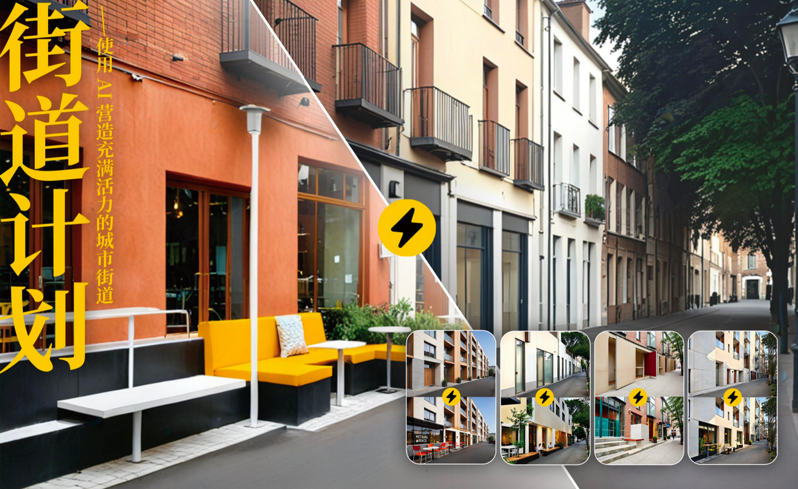

## 项目背景

街道既承担通行，也承载停留、交流与日常生活。基础图像模型虽然能够生成完成度较高的街景效果图，却容易把“活力”简化为人多、商业元素多或色彩明亮，难以回答更本质的问题：当人物和显性活动被移除后，空间本身是否仍能传递“可以进入、停留和使用”的信号？

本项目以可供性（Affordance）为线索，将抽象的街道活力感转译为可观察、可标注和可生成的空间变量，并验证这些变量如何影响专业与非专业人群的活力判断。

## 研究问题

1. 如何把“街道活力”从模糊感知转化为可供模型学习的设计语言？
2. SDXL 经过领域 LoRA 微调后，能否更稳定地响应空间设计手法、界面通透度和沿街开口密度？
3. 在排除人群与显性活动后，哪些空间条件仍能提升公众对街道活力的感知？

## 技术路线

```text
活力概念拆解
  -> 标签体系与数据清洗标准
  -> GPT-4V 初标 + 人工复核
  -> 288 张候选图像与 Caption 配对质检
  -> SDXL 1.0 / LoRA 微调 UNet（16 Epoch）
  -> 5 x 3 x 3 全因子提示词生成
  -> Base / LoRA 对照评测
  -> 问卷、统计分析与访谈编码
  -> Bad Case 归因与数据/训练迭代
```

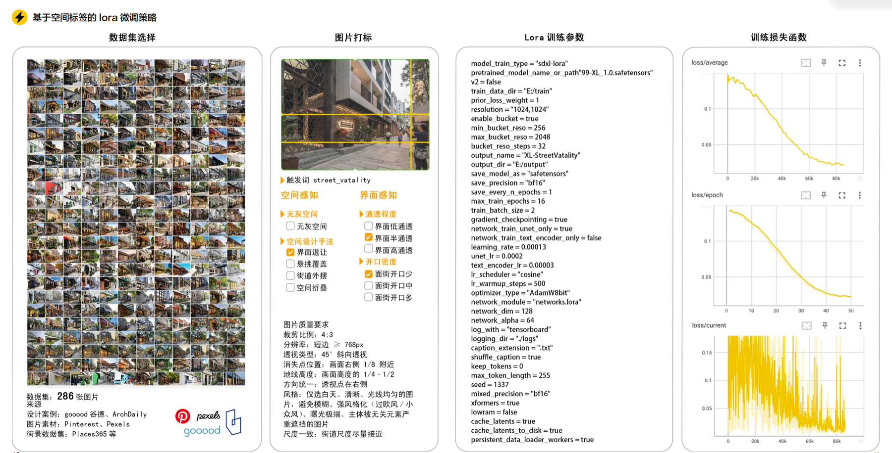

## 项目过程展示

### 1. 训练数据与 Caption

训练图像先由 GPT-4V 根据封闭标签体系完成初标，再由人工复核。每张 PNG 对应一个同名 TXT Caption，供 SDXL LoRA 训练读取。

| 训练样例 1 | 训练样例 2 | 训练样例 3 |
|---|---|---|
|  |  |  |
| `facade_setback, overhang_canopy, high_transparency, limited_entrance` | `overhang_canopy, street_spillout, medium_transparency, multiple_entrance` | `facade_setback, overhang_canopy, street_spillout, high_transparency, multiple_entrance` |

| 训练样例 4 | 训练样例 5 |
|---|---|
| 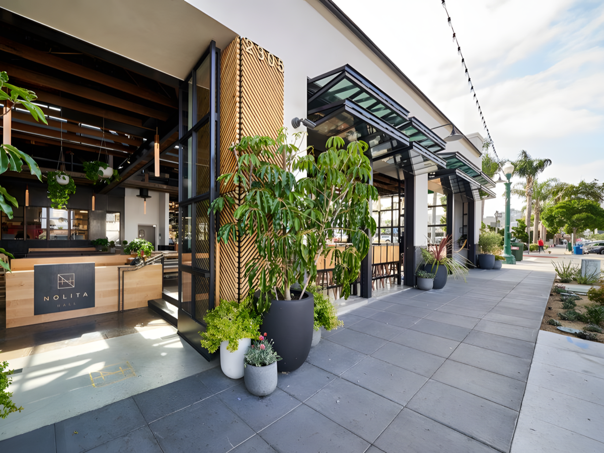 |  |
| `facade_setback, high_transparency, multiple_entrance` | `overhang_canopy, spatial_folding, medium_transparency, limited_entrance` |

### 2. 低活力图像增强

选取前序评价中活力感得分较低的图像，通过图生图统一加入“街道外摆、中等通透度、中等沿街开口”条件，观察可停留线索对活力感知的影响。

| 组别 | 修改前 | 修改后 |
|---|---|---|
| 低活力样本 1 |  | 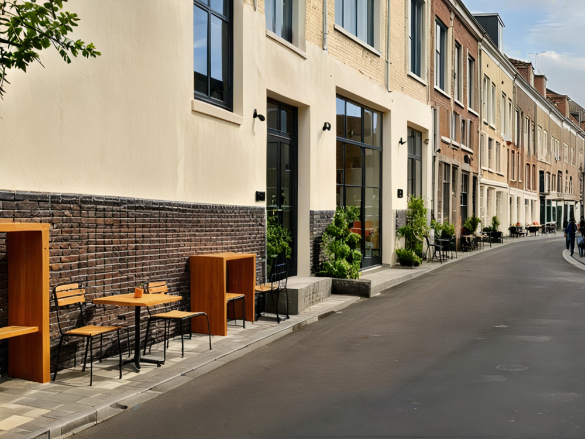 |
| 低活力样本 2 | 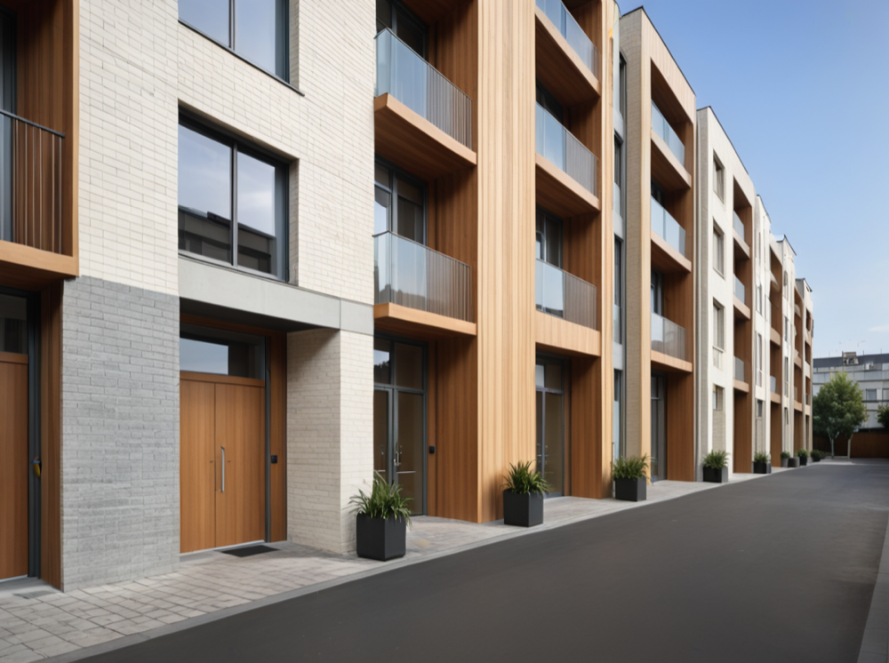 | 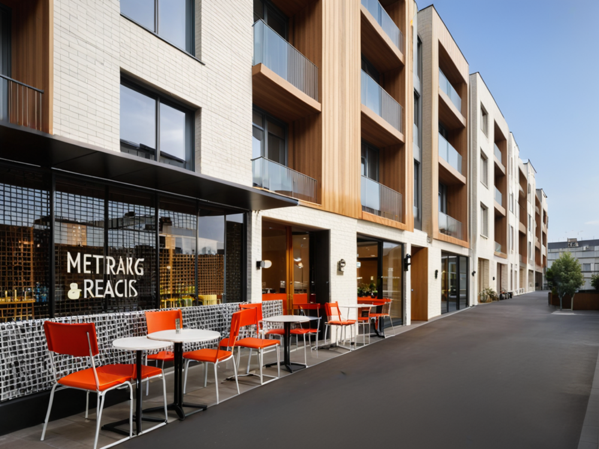 |
| 低活力样本 3 | 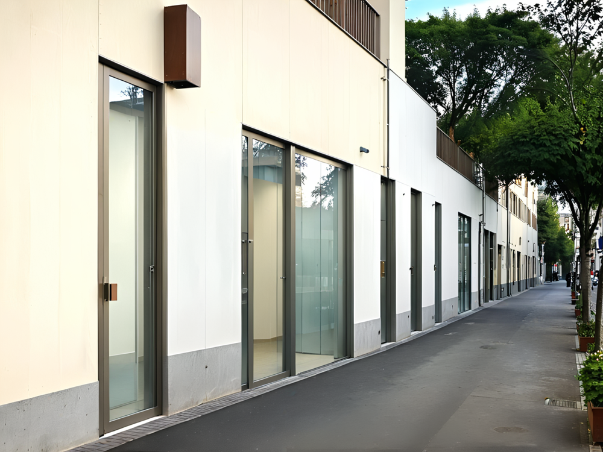 |  |

6 组完整对照、修改前标签与评分见 [`evaluation/vitality-enhancement.md`](evaluation/vitality-enhancement.md)。

### 3. Checkpoint 对比与模型选择

早期实验对 10/20/30 Epoch checkpoint 使用相同提示词进行横向比较，重点检查标签响应、空间真实性、材质质量、构图重复和过拟合趋势。下图提示词为 `spatial_folding, street_spillout, low_transparency, limited_entrance`。

| 10 Epoch | 20 Epoch | 30 Epoch |
|---|---|---|
| 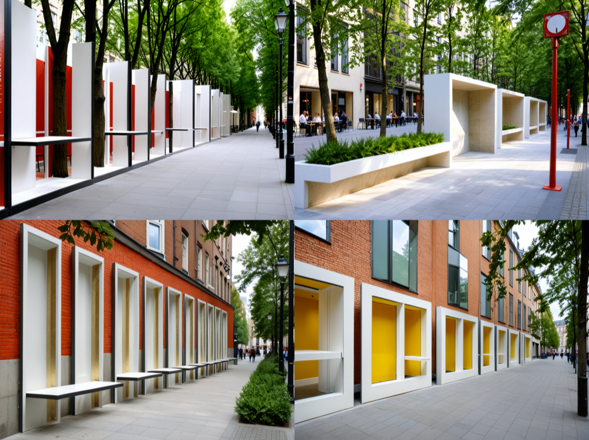 | 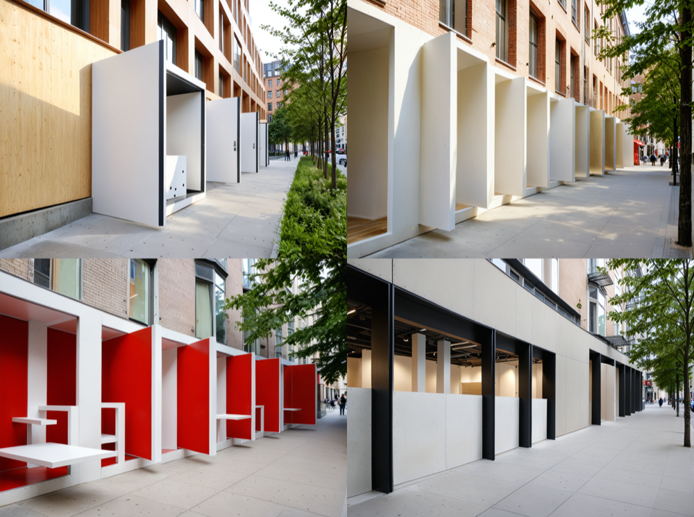 | 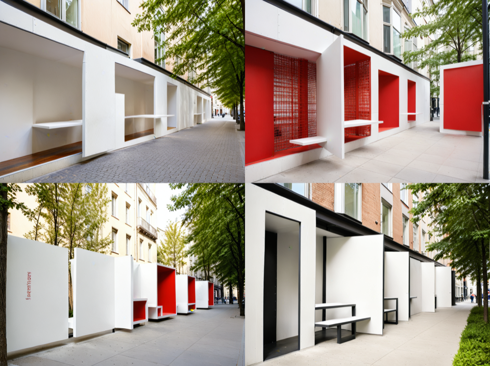 |

该组结果属于探索性 checkpoint 测试，最终复现实验采用 16 Epoch。更多说明见 [`evaluation/checkpoint-testing.md`](evaluation/checkpoint-testing.md)。

### 4. LoRA 标签控制效果

模型能够分别响应空间设计手法、界面通透度和沿街开口数量，也能在组合提示词下同时控制多个空间变量。下图汇总了单标签与组合标签的代表性生成结果。

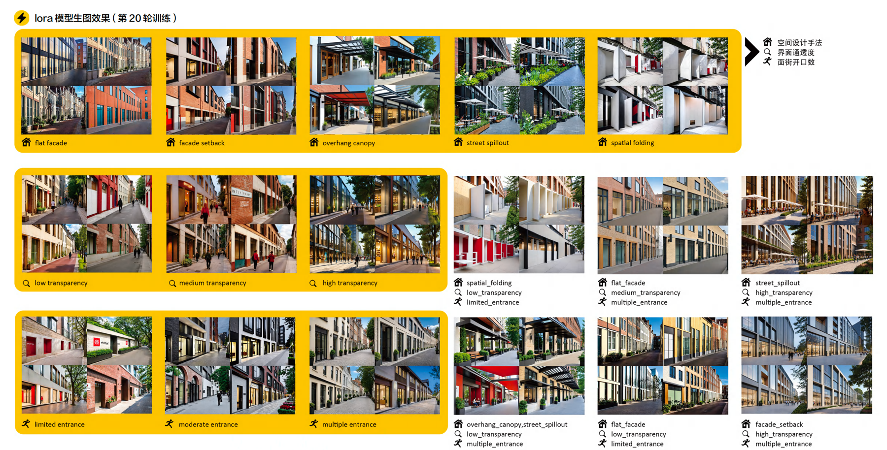

## 标签体系

标签分为两个感知维度，共 11 个封闭标签：

- 空间感知（人可停留）：无灰空间、界面退让、悬挑覆盖、街道外摆、空间折叠。
- 界面感知（人可看见）：低/中/高通透，以及沿街开口少/中/多。

每个标签均定义了可见证据、排除条件、互斥关系和证据不足时的处理方式。通透度依据透明界面比例、室内可见程度和遮挡情况判断；开口密度独立依据可确认的步行入口数量判断，避免混淆两个概念。

详细定义见 [`半自动图像标注工具/prompt_config.json`](半自动图像标注工具/prompt_config.json)。

## AI 辅助标注工具

项目包含一个 Python 桌面端半自动标注工具：

- 批量导入、预览及规定比例裁剪；
- 对短边低于 768 px 的图片进行质量提示；
- 调用视觉模型依据封闭标签体系生成初标；
- 人工检查、修改并确认标签；
- 自动输出同名 PNG 与 TXT Caption；
- 自动统计处理数量、标签分布和数据分类。

原始研究使用 GPT-4V 完成视觉初标。仓库中的模型名称与 API 地址保持可配置，以便替换为当前可用的兼容视觉模型。

工具说明见 [`半自动图像标注工具/README.md`](半自动图像标注工具/README.md)。

## 模型训练

- 基座模型：Stable Diffusion XL 1.0
- 数据规模：288 张候选街道图像；当前目录审计得到 285 组严格同名图文对
- 训练方式：LoRA，仅训练 UNet
- 分辨率：1024 x 1024，启用多尺度 Bucket
- LoRA：Rank 128，Alpha 64
- 优化器：AdamW8bit
- 调度器：Cosine，Warmup 500 steps
- 训练周期：16 Epoch
- 混合精度：BF16

脱敏后的完整训练配置见 [`configs/sdxl-lora.toml`](configs/sdxl-lora.toml)。数据因来源和授权限制未直接公开，详见 [`docs/data-card.md`](docs/data-card.md)。

## 评测设计

采用 5 种空间设计手法 x 3 档界面通透度 x 3 档沿街开口密度的全因子设计，共 45 个测试情境。在固定随机种子、图像尺寸和推理参数的条件下，生成 SDXL Base 与 LoRA 配对样本。

人工盲评采用四项 5 分制指标：

1. 提示词遵循度；
2. 空间真实性；
3. 色彩与材质合理性；
4. 设计可用性。

此外，通过问卷与访谈比较专业和非专业被试的活力感知路径。评测矩阵和评分口径见 [`evaluation/`](evaluation/)。

项目还包含两组补充实验：一组用 6 张低活力样本验证“街道外摆 + 中通透 + 中开口”的图生图增强效果；另一组记录早期 10/20/30 Epoch checkpoint 的提示词响应与过拟合观察。详见 [`evaluation/vitality-enhancement.md`](evaluation/vitality-enhancement.md) 与 [`evaluation/checkpoint-testing.md`](evaluation/checkpoint-testing.md)。

## 主要发现

- 能够支持活动的灰空间、适度的界面通透度和开口数量，更容易提升街道活力感。
- 街道外摆的促进作用最明显，其价值不只是装饰，而是向使用者释放“允许停留”的行为信号。
- 通透度与开口数量并非越高越好；过高可能带来过度暴露、隐私缺失和界面单调。
- 专业被试更依赖结构化设计图式，非专业被试更依赖场景和社会联想。
- 在 45 组配对样本的四项综合评分中，LoRA 模型相较 SDXL Base 的项目记录提升为 36%。原始逐样本评分仍需在公开前补充，以支持结果复核。

## 仓库结构

```text
street-vitality-aigc/
├── README.md
├── configs/              # 脱敏训练配置
├── docs/                 # 研究报告、数据卡与模型卡
├── evaluation/           # 45 组实验矩阵与评分口径
├── examples/             # 训练样例、活力增强对照与 checkpoint 样例
└── 半自动图像标注工具/   # GPT-4V 半自动图像标注工具
```

## 快速开始

```bash
cd 半自动图像标注工具
python3 -m venv .venv
source .venv/bin/activate       # Windows: .venv\Scripts\activate
python -m pip install -r requirements.txt
python labeling_tool.py
```

首次使用 AI 初标前，在工具内配置 API Key、兼容的 Chat Completions 地址与视觉模型名称。请勿提交自动生成的 `api_config.json`。

## 局限与后续工作

- 训练数据规模较小，仍可能存在视角、风格和地域偏差；
- 原始目录有 3 张图像未形成严格同名 Caption 配对，训练前应按数据审计记录修复；
- 视觉模型初标不构成真值，所有训练标签均需人工复核；
- 36% 为项目阶段性综合评分结果，公开仓库仍需补充匿名化原始评分；
- 后续可增加跨城市数据、标注一致性统计及更多随机种子的稳定性评测。

## 研究材料

完整课程研究报告见 [`docs/research-report.pdf`](docs/research-report.pdf)。公开使用报告中的图片、数据和受试者材料前，请先确认相应授权。

课程研究成员与公开前的署名提醒见 [`docs/credits.md`](docs/credits.md)。

## License

代码以 MIT License 发布。研究报告、图片、训练数据和模型权重不因代码许可证而自动获得相同授权。
